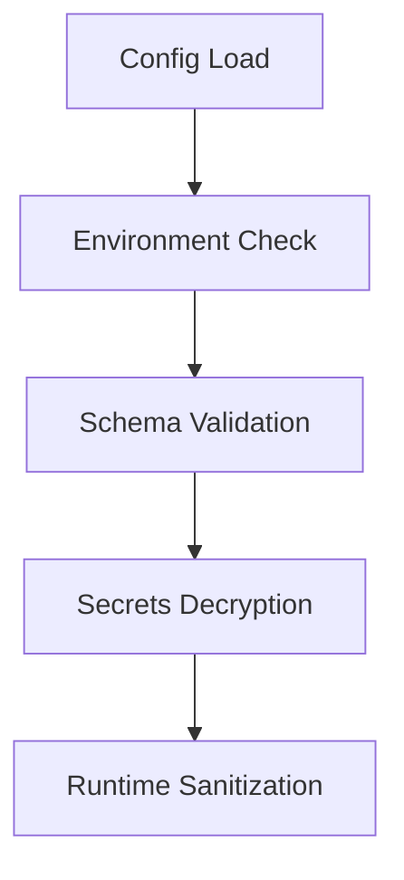

# SPEC-CONFIG-001: Production Configuration Requirements

## Objective
Ensure all configuration files are production-ready and free of placeholder values

## Critical Changes Needed
```yaml
# config/default_config.yml (example)
api_endpoint: "https://api.example.com"  # DEV PLACEHOLDER
storage_path: "/tmp/deepindexer"         # INSECURE DEFAULT
```

## Validation Checklist
- [ ] Remove all example.com references
- [ ] Encrypt sensitive credentials
- [ ] Implement environment separation (dev/stage/prod)
- [ ] Add config schema validation
- [ ] Set file permissions to 600

## Security Requirements


## Implementation Steps
1. Create config loader with strict type checking
2. Integrate with secrets management system
3. Add config file change detection
4. Implement audit logging for sensitive access

## Compliance Checks
1. No plaintext credentials in version control
2. All production paths validated as secure
3. Emergency rotation procedure documented
4. Backup/restore process tested
