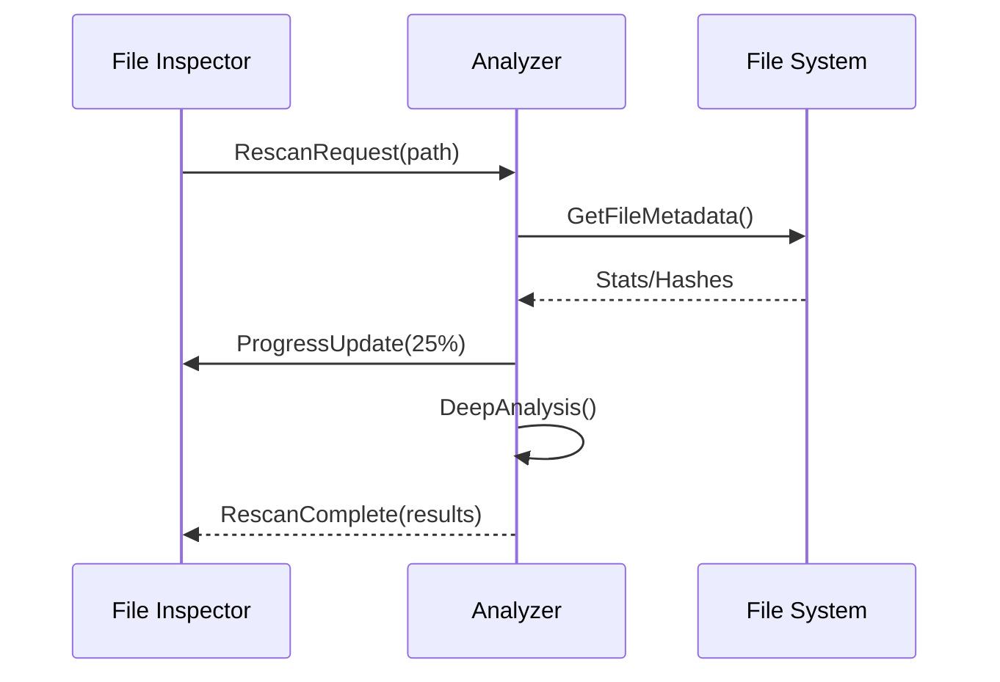

# SPEC-CORE-001: File Rescan Implementation

## Objective
Implement production-grade file rescan functionality with full integration to core analyzer

## Current Gap
```python
# gui/file_inspector.py
QMessageBox.information(self, "Rescan", 
    "This is a placeholder for the rescan functionality")
```

## Requirements
- [ ] Connect to core/analyzer.py rescan_file() method
- [ ] Implement progress reporting with QProgressDialog
- [ ] Add error handling for locked files
- [ ] Support partial rescans with file hash verification
- [ ] Thread-safe cancellation support

## Implementation Flow


## Validation Criteria
1. Functional test with 10k+ files
2. Performance benchmark <500ms per file
3. Error recovery test (locked files)
4. Memory leak check under sustained load
5. Security audit of file handling
