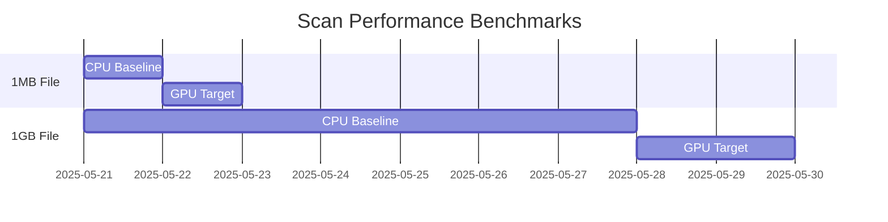

# SPEC-PLUGIN-001: Entropy Scanner Implementation

## Objective
Implement production-grade entropy analysis plugin

## Current Implementation
```python
# plugins/entropy_scanner.py
# TODO: Actual entropy calculation missing
def analyze_entropy(file_path):
    return random.uniform(0, 1)  # Mock implementation
```

## Requirements
- [ ] Shannon entropy calculation with 64-bit precision
- [ ] Streaming file analysis for large files
- [ ] Cache previous scans using file hashes
- [ ] Threshold-based alert system
- [ ] GPU acceleration support

## Performance Targets


## Security Considerations
1. Memory-safe file handling
2. Sandboxed execution environment
3. Audit logging for sensitive files
4. Rate limiting for bulk operations
