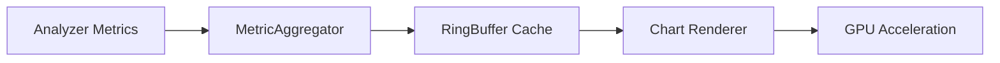

# SPEC-UI-001: Timeline Visualization Implementation

## Objective
Replace placeholder QLabel with QtChart-based real-time visualization of indexing metrics

## Current Implementation
```python
# gui/live_monitor.py
timeline_placeholder = QLabel("Timeline Visualization")
timeline_placeholder.setStyleSheet("color: gray; border: 1px dashed gray; padding: 10px;")
timeline_layout.addWidget(timeline_placeholder)
```

## Requirements
- [ ] QtChart integration with QDateTimeAxis/XYYSeries
- [ ] Real-time data binding to core/analyzer metrics feed
- [ ] Handle 10k+ data points with <100ms rendering latency
- [ ] Memory footprint <50MB for visualization components
- [ ] Zoom/pan controls with preservation of 1-year history

## Data Pipeline


## Validation Criteria
1. Load testing with 50k sample events
2. Memory profiling under max load
3. Cross-platform rendering consistency
4. Crash recovery after 24h continuous run
