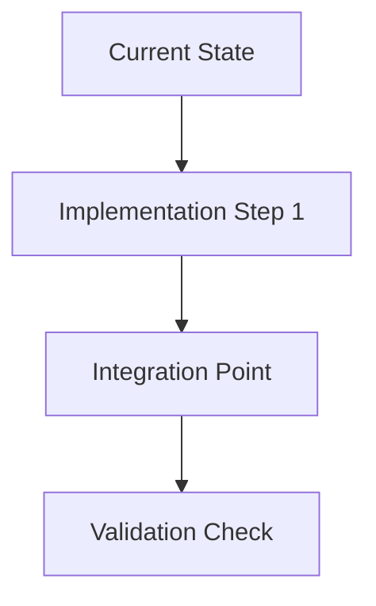

# SPEC-[COMPONENT]-[NUM]: [Brief Title]

## Objective
[Clear implementation goal]

## Current State
```python
# [File/Module Path]
[Code snippet showing current implementation gaps]
```

## Requirements
- [ ] [Functional requirement 1]
- [ ] [Performance target]
- [ ] [Security consideration]

## Implementation Plan


## Validation Criteria
1. [Test scenario 1]
2. [Performance benchmark]
3. [Security audit requirement]

## Version History
| Version | Date       | Author    | Changes            |
|---------|------------|-----------|--------------------|
| 1.0     | YYYY-MM-DD | [Name]    | Initial specification |
