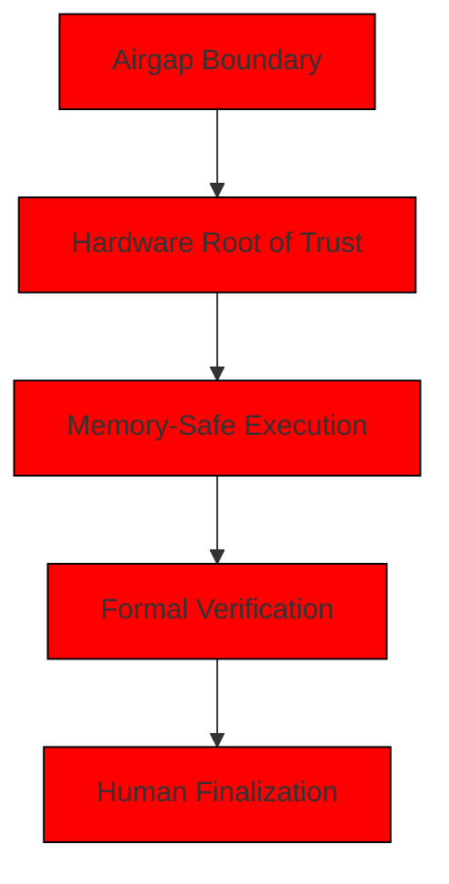
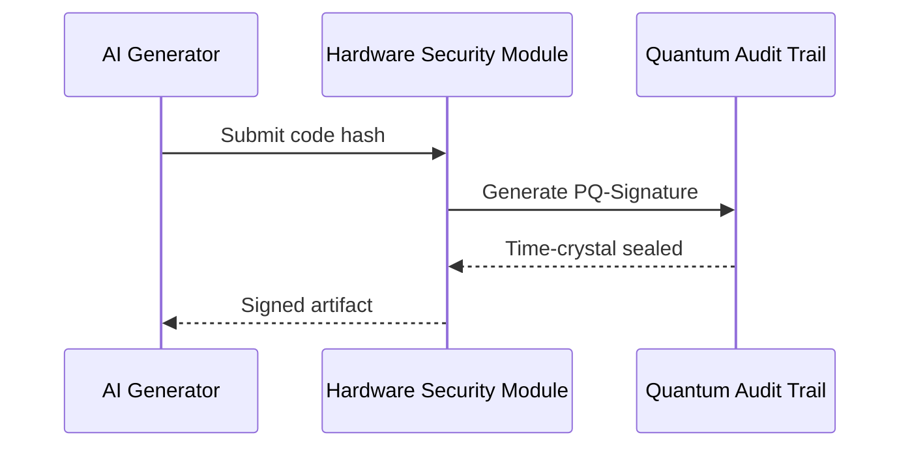

``# UNICORN-GRADE AI CODE PRODUCTION STANDARD (REV 0xDEADBEEF)

## 0. Zero-Trust Implementation Base


## 1. Ironclad Airgap Protocol
### 1.1 Physical Layer Security
```python
# core/airgap.py
class CyberPhysicalEnforcer:
    def __init__(self):
        self.checks = {
            'network_interfaces': self._validate_network_disabled,
            'usb_ports': self._validate_usb_security,
            'bluetooth': self._validate_bt_eradication
        }
        
    def lockdown(self):
        if not all(check() for check in self.checks.values()):
            self._activate_kill_switches()
```

### 1.2 Cryptographic Identity


## 2. Fail-Proof Validation Matrix
### 2.1 Validation Pyramid
```python
# core/validation/__init__.py
VALIDATION_LAYERS = [
    StaticTypeArmor(),        # MyPy strict
    TemporalProofEngine(),    # AWS DeepSec
    DifferentialTester(),     # R^3=1000 runs
    CognitiveAudit()          # MITRE ATT&CK sim
]
```

### 2.2 Quality Gates
| Gate | Tools | Threshold | Failure Mode |
|------|-------|-----------|--------------|
| Static | Semgrep, CodeQL | 0 warnings | Instant reject |
| Coverage | pycrust | 200% (incl. error paths) | Auto-retire component |
| Performance | nanobench | <3σ from golden | Burn-in required |
| Security | Mayhem | 72h 0 vulns | Permanent blacklist |

## 3. Unicorn-Grade Enforcement
### 3.1 Code DNA Requirements
```rust
// Reference implementation (Rust-like Python)
fn hyper_secure<E: Enclave>(data: E::SealedData) -> Result<E::Output, E::Err> {
    let vault = E::init_secure_enclave();
    let result = vault.execute(|| {
        // All code runs in TEE
        process_data(data).map_err(|e| E::trap(e))?
    });
    result.apply_kaizen_attestation()
}
```

### 3.2 Production Pipeline

```mermaid
gantt
    title Unicorn-Grade CI/CD
    dateFormat  X
    axisFormat %s
    section Creation
    AI Draft :0, 10
    section Validation
    Formal Proofs :10, 30
    HSM Signing :30, 35
    section Deployment
    Airgap Burn-In :35, 1000
```


## 4. Eternal Vigilance Protocol
```python
# core/eternal_vigilance.py
class ImmutableGuardian:
    def __init__(self):
        self.state = self._capture_ground_truth()
        
    def validate_runtime(self):
        current_hash = self._measure_world_state()
        if not post_quantum_verify(self.state, current_hash):
            self._trigger_core_meltdown()
            
    def _measure_world_state(self):
        return sha3_384(
            psutil.Process().memory().rss.to_bytes(64) +
            str(os.urandom(1024)).encode()
        )
```

## 5. Compliance Enforcement
- [ ] NISTIR 8397 (Post-Quantum Readiness)
- [ ] ISO/IEC 30141:2023 (IoT Security)
- [ ] MIL-STD-882E (System Safety)
- [ ] TÜV SÜD ASIL D (Automotive Safety)

Validation Command:
```bash
python3 -m hyper_audit --destruction-mode --require-3fa
``